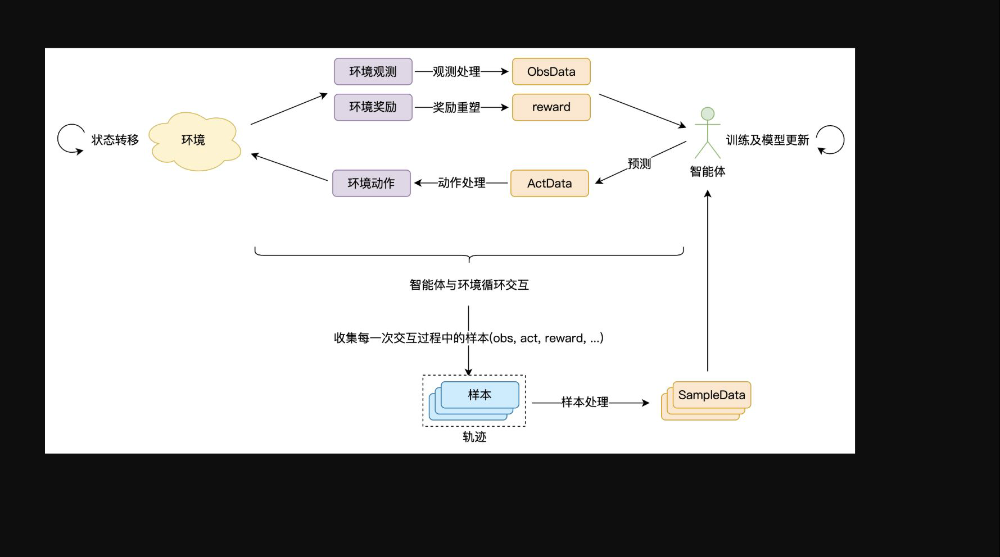

  

  # nanbloom001

  **Intelligent Robotics · Reinforcement Learning · Competition Engineering**

  [Portfolio](https://nanbloom001.github.io) · [Projects](https://github.com/nanbloom001?tab=repositories)

## Focus

I build learning-based systems for embodied intelligence: from simulation environments and policy training to competition-ready autonomous behavior.

- Reinforcement learning for legged and wheeled-leg robots
- Isaac Lab simulation and training workflows
- Autonomous navigation, observation design, and Sim2Real-oriented engineering
- AI algorithm competitions and reproducible project records

## Selected Work

| Project | What it explores | Stack |
| --- | --- | --- |
| [kaiwuFinal](https://github.com/nanbloom001/kaiwuFinal) | Autonomous navigation for the Tencent Kaiwu quadruped robot competition | Python, reinforcement learning, simulation |
| [wheeled_leg_RL](https://github.com/nanbloom001/wheeled_leg_RL) | Wheeled-leg robot policy training with Isaac Lab 2.3.0 | Python, Isaac Lab, RL |
| [2025AiCOMP_ZHSQ](https://github.com/nanbloom001/2025AiCOMP_ZHSQ) | Open-source competition work for the Global Campus AI Algorithm Elite Competition | Python, computer vision / AI |
| [unity_game](https://github.com/nanbloom001/unity_game) | Interactive game development experiments | C#, Unity |

## Working Principles

> Start from the task and the environment, then make the model earn its behavior through evidence.

I care about clear task definitions, observable training loops, and deployment constraints. Code repositories are kept as the source of truth; the portfolio adds the decision context, experiments, and project narrative around them.

## Links

- GitHub: [@nanbloom001](https://github.com/nanbloom001)
- Portfolio: [nanbloom001.github.io](https://nanbloom001.github.io)

